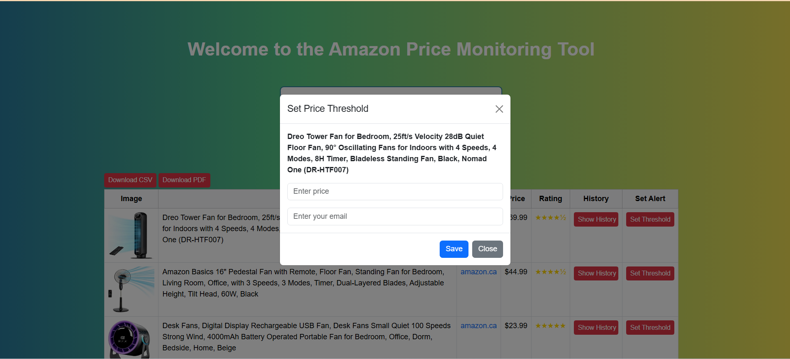

# E-Commerce Price Monitoring Tool

A Flask-based web application that monitors Amazon product prices and sends email alerts when prices drop below user-defined thresholds.

## Features

### 🔍 Product Search
Search for products on Amazon and view results in a clean table format with product images, prices, and ratings.

(static/images/img.png)
(static/images/product-search.png)
(static/images/product-display.png)


### 📊 Price History
View historical price data with interactive charts to track price trends over time.


### 🔔 Price Alerts
Set custom price thresholds and receive email notifications when prices drop below your specified amount.


*Modal dialog for setting up price alerts*


*Sample email notification for price drop*

### 📋 Data Export
Export search results to CSV or PDF formats for offline analysis and record keeping.


### ⏰ Scheduled Monitoring
Automatically checks prices every 6 hours and sends alerts when thresholds are met.

### ⭐ Rating Display
Shows product ratings with intuitive star visualization for quick quality assessment.


## Tech Stack

- **Backend**: Flask (Python)
- **Database**: PostgreSQL
- **Web Scraping**: Selenium WebDriver
- **Frontend**: HTML, CSS, JavaScript, Bootstrap 5
- **Charts**: Chart.js
- **Email**: SMTP (Gmail)
- **Scheduling**: APScheduler

## Prerequisites

- Python 3.7+
- PostgreSQL database
- Chrome browser (for Selenium)
- Gmail account for email alerts

## Installation

1. **Clone the repository**
   ```bash
   git clone https://github.com/SreejaSreekumarSujatha/AmazonPriceMonitoringTool.git
   cd AmazonPriceMonitoringTool
   ```

2. **Create virtual environment**
   ```bash
   python -m venv .venv
   source .venv/bin/activate  # On Windows: .venv\Scripts\activate
   ```

3. **Install dependencies**
   ```bash
   pip install -r requirements.txt
   ```

4. **Set up PostgreSQL database**
   ```sql
   CREATE DATABASE price_monitor;
   ```

5. **Create database tables**
   
   **Option A: Use the provided SQL file**
   ```bash
   psql -U your_username -d price_monitor -f ecommerce_db.sql
   ```
   
   **Option B: Run SQL commands manually**
   ```sql
   -- Copy and paste the complete schema from ecommerce_db.sql below
   -- Or use the manual table creation:
   
   CREATE TABLE product (
       id SERIAL PRIMARY KEY,
       name VARCHAR(255) NOT NULL,
       created_at TIMESTAMP DEFAULT CURRENT_TIMESTAMP
   );

   CREATE TABLE product_listing (
       id SERIAL PRIMARY KEY,
       product_id INTEGER REFERENCES product(id),
       site_name VARCHAR(50),
       product_name TEXT,
       image_url TEXT,
       url TEXT UNIQUE,
       rating DECIMAL(3,2),
       created_at TIMESTAMP DEFAULT CURRENT_TIMESTAMP
   );

   CREATE TABLE price_history (
       id SERIAL PRIMARY KEY,
       listing_id INTEGER REFERENCES product_listing(id),
       price DECIMAL(10,2),
       scraped_at TIMESTAMP DEFAULT CURRENT_TIMESTAMP
   );

   CREATE TABLE alert_thresholds (
       id SERIAL PRIMARY KEY,
       product_name VARCHAR(255),
       email VARCHAR(255),
       threshold_price DECIMAL(10,2),
       created_at TIMESTAMP DEFAULT CURRENT_TIMESTAMP
   );
   ```

6. **Configure environment variables**
   Create an `index.env` file in the root directory:
   ```env
   # Database Configuration
   DB_NAME=price_monitor
   DB_USER=your_db_user
   DB_PASS=your_db_password
   DB_HOST=localhost
   DB_PORT=5432

   # Email Configuration (Gmail)
   EMAIL_USER=your_email@gmail.com
   EMAIL_PASS=your_app_password
   ```

   **Note**: For Gmail, you'll need to use an App Password instead of your regular password. Enable 2FA and generate an App Password in your Google Account settings.

## Usage

### 1. Start the Application
```bash
python index.py
```


###  Access the Web Interface
Open your browser and go to `http://localhost:5000`


*Main application homepage with search interface*

###  Search for Products
- Enter a product name in the search box
- Click "Search" to view results from Amazon


###  View Price History
- Click "Show History" button next to any product
- Interactive chart will display below the product row


###  Set Price Alerts
- Click "Set Threshold" button
- Enter your desired price threshold and email
- You'll receive notifications when prices drop below your threshold


###  Export Data
- Use "Download CSV" or "Download PDF" buttons to export search results


*Sample PDF export layout*

## Project Structure

```
ECommercePriceMonitoringTool/
├── images/                   # Screenshots and documentation images
│   ├── product-search.png
│   ├── price-history.png
│   ├── price-alert-modal.png
│   ├── email-alert.png
│   ├── export-options.png
│   ├── csv-export.png
│   ├── star-ratings.png
│   ├── app-startup.png
│   ├── homepage.png
│   ├── search-process.gif
│   ├── search-results.png
│   ├── show-history-button.png
│   ├── price-history-expanded.png
│   ├── set-threshold-button.png
│   ├── threshold-modal-filled.png
│   ├── alert-confirmation.png
│   ├── export-buttons.png
│   ├── pdf-export-sample.png
│   ├── database-schema.png
│   └── architecture-diagram.png
├── static/
│   ├── css/
│   │   └── style.css
│   └── js/
│       └── script.js
├── templates/
│   └── index.html
├── .venv/
├── index.py              # Main Flask application
├── index.env             # Environment variables
├── ecommerce_db.sql      # Database schema
├── requirements.txt      # Python dependencies
├── .gitignore
└── README.md
```


## Configuration

## Database Schema

### Complete SQL Schema (`ecommerce_db.sql`)

The following SQL script contains the complete database schema. You can either run this file directly or execute the commands manually:

```sql
-- E-Commerce Price Monitoring Tool Database Schema
-- File: ecommerce_db.sql

-- Create database (run this separately if needed)
-- CREATE DATABASE price_monitor;

-- Connect to the database
-- \c price_monitor;

-- Enable UUID extension (optional, for future use)
-- CREATE EXTENSION IF NOT EXISTS "uuid-ossp";

-- Table: product
-- Stores unique product names that users search for
CREATE TABLE IF NOT EXISTS product (
    id SERIAL PRIMARY KEY,
    name VARCHAR(255) NOT NULL UNIQUE,
    description TEXT,
    category VARCHAR(100),
    created_at TIMESTAMP DEFAULT CURRENT_TIMESTAMP,
    updated_at TIMESTAMP DEFAULT CURRENT_TIMESTAMP
);

-- Table: product_listing
-- Stores individual product listings from different sites (Amazon, etc.)
CREATE TABLE IF NOT EXISTS product_listing (
    id SERIAL PRIMARY KEY,
    product_id INTEGER NOT NULL REFERENCES product(id) ON DELETE CASCADE,
    site_name VARCHAR(50) NOT NULL DEFAULT 'amazon',
    product_name TEXT NOT NULL,
    image_url TEXT,
    url TEXT UNIQUE NOT NULL,
    rating DECIMAL(3,2) CHECK (rating >= 0 AND rating <= 5),
    review_count INTEGER DEFAULT 0,
    availability VARCHAR(50) DEFAULT 'in_stock',
    created_at TIMESTAMP DEFAULT CURRENT_TIMESTAMP,
    updated_at TIMESTAMP DEFAULT CURRENT_TIMESTAMP
);

-- Table: price_history
-- Stores historical price data for each product listing
CREATE TABLE IF NOT EXISTS price_history (
    id SERIAL PRIMARY KEY,
    listing_id INTEGER NOT NULL REFERENCES product_listing(id) ON DELETE CASCADE,
    price DECIMAL(10,2),
    currency VARCHAR(3) DEFAULT 'USD',
    scraped_at TIMESTAMP DEFAULT CURRENT_TIMESTAMP,
    is_sale BOOLEAN DEFAULT FALSE,
    original_price DECIMAL(10,2)
);

-- Table: alert_thresholds
-- Stores user-defined price alert thresholds
CREATE TABLE IF NOT EXISTS alert_thresholds (
    id SERIAL PRIMARY KEY,
    product_name VARCHAR(255) NOT NULL,
    email VARCHAR(255) NOT NULL,
    threshold_price DECIMAL(10,2) NOT NULL CHECK (threshold_price > 0),
    is_active BOOLEAN DEFAULT TRUE,
    alert_sent_count INTEGER DEFAULT 0,
    last_alert_sent TIMESTAMP,
    created_at TIMESTAMP DEFAULT CURRENT_TIMESTAMP,
    updated_at TIMESTAMP DEFAULT CURRENT_TIMESTAMP
);

-- Table: scraping_logs (optional, for monitoring)
CREATE TABLE IF NOT EXISTS scraping_logs (
    id SERIAL PRIMARY KEY,
    product_name VARCHAR(255),
    site_name VARCHAR(50),
    status VARCHAR(20) DEFAULT 'success', -- success, failed, blocked
    items_found INTEGER DEFAULT 0,
    error_message TEXT,
    execution_time_ms INTEGER,
    scraped_at TIMESTAMP DEFAULT CURRENT_TIMESTAMP
);

-- Table: email_logs (optional, for tracking email alerts)
CREATE TABLE IF NOT EXISTS email_logs (
    id SERIAL PRIMARY KEY,
    recipient_email VARCHAR(255) NOT NULL,
    product_name VARCHAR(255),
    price_dropped_to DECIMAL(10,2),
    threshold_price DECIMAL(10,2),
    email_status VARCHAR(20) DEFAULT 'sent', -- sent, failed, pending
    sent_at TIMESTAMP DEFAULT CURRENT_TIMESTAMP,
    error_message TEXT
);

-- Indexes for better performance
CREATE INDEX IF NOT EXISTS idx_product_name ON product(name);
CREATE INDEX IF NOT EXISTS idx_product_listing_url ON product_listing(url);
CREATE INDEX IF NOT EXISTS idx_product_listing_site ON product_listing(site_name);
CREATE INDEX IF NOT EXISTS idx_price_history_listing ON price_history(listing_id);
CREATE INDEX IF NOT EXISTS idx_price_history_date ON price_history(scraped_at);
CREATE INDEX IF NOT EXISTS idx_alert_thresholds_email ON alert_thresholds(email);
CREATE INDEX IF NOT EXISTS idx_alert_thresholds_active ON alert_thresholds(is_active);

-- Triggers for updating timestamps
CREATE OR REPLACE FUNCTION update_updated_at_column()
RETURNS TRIGGER AS $
BEGIN
    NEW.updated_at = CURRENT_TIMESTAMP;
    RETURN NEW;
END;
$ language 'plpgsql';

CREATE TRIGGER update_product_updated_at 
    BEFORE UPDATE ON product 
    FOR EACH ROW EXECUTE FUNCTION update_updated_at_column();

CREATE TRIGGER update_product_listing_updated_at 
    BEFORE UPDATE ON product_listing 
    FOR EACH ROW EXECUTE FUNCTION update_updated_at_column();

CREATE TRIGGER update_alert_thresholds_updated_at 
    BEFORE UPDATE ON alert_thresholds 
    FOR EACH ROW EXECUTE FUNCTION update_updated_at_column();

-- Sample data (optional, for testing)
INSERT INTO product (name, description, category) VALUES 
    ('Sample Laptop', 'Test product for demonstration', 'Electronics'),
    ('Sample Phone', 'Test mobile device', 'Electronics')
ON CONFLICT (name) DO NOTHING;

-- Views for common queries
CREATE OR REPLACE VIEW latest_prices AS
SELECT 
    pl.id as listing_id,
    p.name as product_name,
    pl.product_name as listing_name,
    pl.site_name,
    pl.url,
    pl.rating,
    ph.price as current_price,
    ph.scraped_at as last_updated
FROM product_listing pl
JOIN product p ON pl.product_id = p.id
JOIN price_history ph ON pl.id = ph.listing_id
WHERE ph.scraped_at = (
    SELECT MAX(scraped_at) 
    FROM price_history ph2 
    WHERE ph2.listing_id = pl.id
);

CREATE OR REPLACE VIEW price_alerts_summary AS
SELECT 
    at.email,
    at.product_name,
    at.threshold_price,
    lp.current_price,
    lp.last_updated,
    CASE 
        WHEN lp.current_price <= at.threshold_price THEN 'ALERT_TRIGGERED'
        ELSE 'MONITORING'
    END as alert_status,
    at.alert_sent_count,
    at.last_alert_sent
FROM alert_thresholds at
LEFT JOIN latest_prices lp ON LOWER(lp.product_name) LIKE LOWER('%' || at.product_name || '%')
WHERE at.is_active = TRUE;

-- Comments for documentation
COMMENT ON TABLE product IS 'Stores unique product names searched by users';
COMMENT ON TABLE product_listing IS 'Individual product listings from e-commerce sites';
COMMENT ON TABLE price_history IS 'Historical price data for tracking trends';
COMMENT ON TABLE alert_thresholds IS 'User-defined price alert configurations';
COMMENT ON TABLE scraping_logs IS 'Logs for monitoring scraping performance';
COMMENT ON TABLE email_logs IS 'Logs for tracking email alert delivery';

-- Permissions (adjust as needed for your environment)
-- GRANT ALL PRIVILEGES ON ALL TABLES IN SCHEMA public TO price_monitor_user;
-- GRANT USAGE, SELECT ON ALL SEQUENCES IN SCHEMA public TO price_monitor_user;
```

### Running the Schema

**Method 1: Using psql command line**
```bash
psql -U your_username -d price_monitor -f ecommerce_db.sql
```

**Method 2: Using pgAdmin or database GUI**
1. Open your PostgreSQL GUI tool
2. Connect to your database
3. Copy and paste the SQL content above
4. Execute the script

**Method 3: Using Python script**
```python
import psycopg2
from psycopg2 import sql

# Read and execute the SQL file
with open('ecommerce_db.sql', 'r') as file:
    sql_script = file.read()

conn = psycopg2.connect(
    dbname="price_monitor",
    user="your_username", 
    password="your_password",
    host="localhost"
)
cur = conn.cursor()
cur.execute(sql_script)
conn.commit()
cur.close()
### Database Features

#### **Core Tables:**
- **`product`**: Stores unique product search terms
- **`product_listing`**: Individual Amazon listings for each product
- **`price_history`**: Historical price data with timestamps
- **`alert_thresholds`**: User-defined price alert configurations

#### **Optional Monitoring Tables:**
- **`scraping_logs`**: Track scraping performance and errors
- **`email_logs`**: Monitor email alert delivery status

#### **Advanced Features:**
- **Automatic timestamps** with triggers for `updated_at` fields
- **Database constraints** for data integrity (price > 0, rating 0-5)
- **Indexes** for optimized query performance
- **Views** for common data queries (`latest_prices`, `price_alerts_summary`)
- **Foreign key relationships** with cascade deletes
- **Sample data** for testing and development

#### **Schema Relationships:**
```
product (1) ──── (many) product_listing (1) ──── (many) price_history
                                   │
                                   │
alert_thresholds ──── (linked by product_name matching)
```

### Database Migration Notes

If you're updating from an existing database, you may need to run migrations:

```sql
-- Add new columns (example for future updates)
ALTER TABLE product_listing ADD COLUMN IF NOT EXISTS review_count INTEGER DEFAULT 0;
ALTER TABLE price_history ADD COLUMN IF NOT EXISTS currency VARCHAR(3) DEFAULT 'USD';
ALTER TABLE alert_thresholds ADD COLUMN IF NOT EXISTS is_active BOOLEAN DEFAULT TRUE;

-- Update existing data
UPDATE alert_thresholds SET is_active = TRUE WHERE is_active IS NULL;
```

### Email Setup
- Gmail SMTP is configured by default
- To use other email providers, modify the SMTP settings in `index.py`
- Make sure to enable "Less secure app access" or use App Passwords


### Scraping Settings
- The tool scrapes up to 5 products per search
- Automatic price checking runs every 6 hours
- Modify the schedule in `index.py` if needed

### Database
- PostgreSQL is required for data persistence
- Update connection settings in `index.env`


## API Endpoints

- `GET /` - Main application page
- `GET /scrape?product=<name>` - Search for products
- `GET /api/history?listing_id=<id>` - Get price history
- `POST /set-threshold` - Set price alert threshold

## Troubleshooting

### Common Issues

#### 1. Selenium WebDriver Issues
- Make sure Chrome is installed
- ChromeDriver is automatically managed by webdriver-manager


#### 2. Database Connection Issues
- Verify PostgreSQL is running
- Check database credentials in `index.env`


#### 3. Email Not Sending
- Verify Gmail credentials
- Use App Password instead of regular password
- Check if 2FA is enabled


#### 4. Scraping Blocked
- Amazon may block requests; the tool includes retry logic
- Consider adding delays between requests


### Logs
- Application logs are displayed in the console
- Set logging level to DEBUG for detailed information


## Contributing

1. Fork the repository
2. Create a feature branch
3. Make your changes
4. Add tests if applicable
5. Submit a pull request

## Legal Notice

This tool is for educational purposes only. Make sure to comply with Amazon's Terms of Service and robots.txt when scraping. Consider implementing rate limiting and respectful scraping practices.

## License

This project is licensed under the MIT License - see the LICENSE file for details.

## Support

For issues and questions:
1. Check the troubleshooting section
2. Review application logs
3. Create an issue in the repository

## Future Enhancements

- Support for additional e-commerce sites
- Mobile responsive design improvements
- User authentication system
- Advanced filtering and sorting
- Bulk price threshold management
- API rate limiting
- Caching mechanisms
